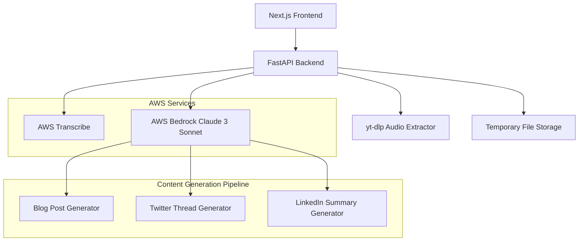

# Design Document

## Overview

ContentFlow AI is a full-stack web application that transforms YouTube videos into multiple content formats using AWS AI services. The system follows a microservices architecture with a Next.js frontend, FastAPI backend, and AWS cloud services for AI processing.

The application workflow consists of: URL validation → audio extraction → transcription → content generation → display. The system prioritizes user experience with real-time progress updates, error handling, and responsive design.

## Architecture



### System Components

**Frontend Layer (Next.js + Tailwind CSS)**
- Single-page application with responsive design
- Real-time progress indicators and status updates
- Content display with copy/export functionality
- Error handling with user-friendly messages

**Backend Layer (FastAPI)**
- RESTful API with async request handling
- YouTube URL validation and processing
- Integration with AWS services
- Temporary file management and cleanup

**AI Processing Layer (AWS Services)**
- AWS Transcribe for speech-to-text conversion
- AWS Bedrock (Claude 3 Sonnet) for content generation
- Automatic retry logic and error handling

## Components and Interfaces

### Frontend Components

**MainPage Component**
```typescript
interface MainPageProps {
  onVideoSubmit: (url: string) => Promise<void>;
  processingState: ProcessingState;
  generatedContent: ContentPackage | null;
}

interface ProcessingState {
  status: 'idle' | 'validating' | 'extracting' | 'transcribing' | 'generating' | 'complete' | 'error';
  progress: number;
  message: string;
  error?: string;
}
```

**ContentDisplay Component**
```typescript
interface ContentDisplayProps {
  content: ContentPackage;
  onCopy: (contentType: ContentType) => void;
  onEdit: (contentType: ContentType, newContent: string) => void;
}

interface ContentPackage {
  blogPost: BlogContent;
  twitterThread: TwitterContent;
  linkedinSummary: LinkedInContent;
  originalTranscript: string;
  videoMetadata: VideoMetadata;
}
```

### Backend API Endpoints

**POST /api/process-video**
```python
class VideoProcessRequest(BaseModel):
    url: str
    options: Optional[ProcessingOptions] = None

class ProcessingOptions(BaseModel):
    max_duration_minutes: int = 60
    include_timestamps: bool = False
    content_style: str = "professional"

class VideoProcessResponse(BaseModel):
    task_id: str
    status: str
    estimated_completion_time: int
```

**GET /api/status/{task_id}**
```python
class ProcessingStatus(BaseModel):
    task_id: str
    status: ProcessingStatusEnum
    progress: float
    current_step: str
    result: Optional[ContentPackage] = None
    error: Optional[str] = None
```

**GET /api/result/{task_id}**
```python
class ProcessingResult(BaseModel):
    task_id: str
    content: ContentPackage
    processing_time: float
    created_at: datetime
```

### AWS Service Integrations

**Transcribe Service Interface**
```python
class TranscribeService:
    async def transcribe_audio(self, audio_file_path: str) -> TranscriptionResult:
        # Upload to S3, start transcription job, poll for completion
        pass
    
    async def get_transcription_status(self, job_name: str) -> TranscriptionStatus:
        pass
```

**Bedrock Content Generator**
```python
class BedrockContentGenerator:
    async def generate_blog_post(self, transcript: str, metadata: VideoMetadata) -> BlogContent:
        # Use Claude 3 Sonnet with structured prompts
        pass
    
    async def generate_twitter_thread(self, transcript: str, metadata: VideoMetadata) -> TwitterContent:
        pass
    
    async def generate_linkedin_summary(self, transcript: str, metadata: VideoMetadata) -> LinkedInContent:
        pass
```

## Data Models

### Core Data Structures

```python
class VideoMetadata(BaseModel):
    title: str
    duration: int
    channel: str
    description: str
    upload_date: datetime
    view_count: int
    tags: List[str]

class BlogContent(BaseModel):
    title: str
    meta_description: str
    content: str
    headings: List[str]
    word_count: int
    estimated_read_time: int
    seo_keywords: List[str]

class TwitterContent(BaseModel):
    thread: List[TwitterPost]
    total_posts: int
    hashtags: List[str]
    estimated_engagement_score: float

class TwitterPost(BaseModel):
    content: str
    character_count: int
    order: int

class LinkedInContent(BaseModel):
    summary: str
    key_points: List[str]
    call_to_action: str
    professional_hashtags: List[str]
    word_count: int

class TranscriptionResult(BaseModel):
    text: str
    confidence_score: float
    duration: float
    segments: List[TranscriptSegment]
    language_detected: str

class TranscriptSegment(BaseModel):
    text: str
    start_time: float
    end_time: float
    confidence: float
    speaker_label: Optional[str]
```

### Database Schema (Optional - Session Storage)

```sql
-- For tracking processing jobs (optional persistent storage)
CREATE TABLE processing_jobs (
    id UUID PRIMARY KEY,
    video_url VARCHAR(500) NOT NULL,
    status VARCHAR(50) NOT NULL,
    created_at TIMESTAMP DEFAULT NOW(),
    completed_at TIMESTAMP,
    result_data JSONB,
    error_message TEXT
);

CREATE INDEX idx_processing_jobs_status ON processing_jobs(status);
CREATE INDEX idx_processing_jobs_created_at ON processing_jobs(created_at);
```

## Correctness Properties

*A property is a characteristic or behavior that should hold true across all valid executions of a system—essentially, a formal statement about what the system should do. Properties serve as the bridge between human-readable specifications and machine-verifiable correctness guarantees.*

Based on the prework analysis, the following properties validate the system's correctness:

**Property 1: URL Validation and Processing**
*For any* YouTube URL input, the system should correctly identify valid URLs and extract video IDs, while rejecting invalid URLs with descriptive error messages and maintaining system state
**Validates: Requirements 1.1, 1.2**

**Property 2: Input State Management**
*For any* input field state, clearing the input should reset all related system state variables to their initial values
**Validates: Requirements 1.5**

**Property 3: Processing Performance**
*For any* valid YouTube URL, the system should initiate transcription workflow within the specified 5-second time limit
**Validates: Requirements 1.3**

**Property 4: Transcription Workflow**
*For any* valid YouTube URL, the system should successfully extract audio, generate a complete transcript, and store it temporarily for content generation
**Validates: Requirements 2.1, 2.5**

**Property 5: Transcription Error Handling**
*For any* transcription failure scenario, the system should return appropriate error messages explaining the specific failure type
**Validates: Requirements 2.2**

**Property 6: Video Duration Limits**
*For any* video up to 60 minutes in length, the transcription service should process it successfully without duration-related errors
**Validates: Requirements 2.4**

**Property 7: Content Generation Structure**
*For any* transcript input, the content generator should produce blog posts with proper SEO structure (title, headings, meta description), Twitter threads within character limits with hashtags, and LinkedIn summaries with professional formatting
**Validates: Requirements 3.1, 3.2, 3.3**

**Property 8: Retry Logic**
*For any* content generation failure, the system should attempt exactly 3 retries before returning a final error
**Validates: Requirements 3.5**

**Property 9: Clipboard Functionality**
*For any* generated content format, clicking the copy button should transfer the correct content to the system clipboard
**Validates: Requirements 4.2**

**Property 10: Content Editing**
*For any* generated content, user edits should be properly saved and reflected in the display and copy operations
**Validates: Requirements 4.4**

**Property 11: Download Options**
*For any* generated content package, download options should be available and functional for each content format
**Validates: Requirements 4.5**

**Property 12: Error Message Security**
*For any* AWS service failure, the system should display user-friendly error messages without exposing technical implementation details
**Validates: Requirements 5.1**

**Property 13: Network Error Handling**
*For any* network connectivity issue, the system should detect the problem and suggest appropriate retry actions
**Validates: Requirements 5.3**

**Property 14: Privacy-Preserving Logging**
*For any* error condition, the system should log debugging information while maintaining user privacy and not exposing sensitive data
**Validates: Requirements 5.4**

**Property 15: Performance Requirements**
*For any* 10-minute video, the complete content generation process should finish within the 3-minute time limit
**Validates: Requirements 6.1**

**Property 16: Concurrent Processing**
*For any* number of simultaneous users, the system should handle concurrent requests without performance degradation
**Validates: Requirements 6.2**

**Property 17: Timeout Handling**
*For any* AWS service experiencing high latency, the system should implement appropriate timeout mechanisms
**Validates: Requirements 6.4**

**Property 18: Caching Behavior**
*For any* frequently accessed data, repeated requests should be served from cache to improve response times
**Validates: Requirements 6.5**

**Property 19: Data Cleanup**
*For any* processing session, the system should not permanently store video files, should automatically delete temporary files after processing, and should not retain generated content beyond the session
**Validates: Requirements 7.1, 7.2, 7.4**

**Property 20: HTTPS Communication**
*For any* client-server communication, the system should use HTTPS protocol exclusively
**Validates: Requirements 7.3**

**Property 21: Responsive Design**
*For any* screen size (desktop, tablet, mobile), the user interface should maintain effective functionality and layout
**Validates: Requirements 8.3**

<function_calls>
<invoke name="prework">
<parameter name="featureName">contentflow-ai

## Error Handling

### Error Categories and Responses

**Input Validation Errors**
- Invalid YouTube URLs: Return specific format requirements
- Unsupported video types: Explain supported formats and limitations
- Video too long: Provide duration limits and suggest alternatives

**Service Integration Errors**
- AWS Transcribe failures: Retry with exponential backoff, fallback to error message
- AWS Bedrock failures: Implement circuit breaker pattern, retry up to 3 times
- Network timeouts: Provide clear timeout messages with retry options

**Resource Management Errors**
- Insufficient storage: Clean up temporary files, provide storage status
- Memory limitations: Implement streaming processing for large files
- Rate limiting: Queue requests with estimated wait times

**User Experience Error Handling**
- Progressive error disclosure: Show basic error first, details on request
- Actionable error messages: Always provide next steps or alternatives
- Error recovery: Allow users to retry or modify inputs without losing progress

### Error Logging and Monitoring

```python
class ErrorHandler:
    def log_error(self, error: Exception, context: Dict[str, Any]) -> None:
        # Log technical details for debugging
        # Sanitize user data before logging
        # Include correlation IDs for request tracking
        pass
    
    def format_user_error(self, error: Exception) -> UserErrorResponse:
        # Convert technical errors to user-friendly messages
        # Remove sensitive information
        # Provide actionable guidance
        pass
```

## Testing Strategy

### Dual Testing Approach

The system requires both unit testing and property-based testing for comprehensive coverage:

**Unit Tests** focus on:
- Specific examples and edge cases
- Integration points between components  
- Error conditions and boundary cases
- AWS service mock responses

**Property Tests** focus on:
- Universal properties across all inputs
- Comprehensive input coverage through randomization
- System behavior validation under various conditions

### Property-Based Testing Configuration

**Framework Selection**: Use Hypothesis for Python backend testing and fast-check for TypeScript frontend testing.

**Test Configuration**:
- Minimum 100 iterations per property test
- Each property test references its design document property
- Tag format: **Feature: contentflow-ai, Property {number}: {property_text}**

**Property Test Examples**:

```python
# Property 1: URL Validation and Processing
@given(youtube_url_strategy())
def test_url_validation_property(url):
    """Feature: contentflow-ai, Property 1: URL Validation and Processing"""
    result = video_processor.validate_url(url)
    if is_valid_youtube_url(url):
        assert result.is_valid
        assert result.video_id is not None
    else:
        assert not result.is_valid
        assert result.error_message is not None

# Property 7: Content Generation Structure  
@given(transcript_strategy())
def test_content_generation_structure(transcript):
    """Feature: contentflow-ai, Property 7: Content Generation Structure"""
    content = content_generator.generate_all_formats(transcript)
    
    # Blog post structure
    assert content.blog_post.title is not None
    assert content.blog_post.meta_description is not None
    assert len(content.blog_post.headings) > 0
    
    # Twitter thread constraints
    for post in content.twitter_thread.thread:
        assert len(post.content) <= 280
    assert len(content.twitter_thread.hashtags) > 0
    
    # LinkedIn professional formatting
    assert content.linkedin_summary.call_to_action is not None
    assert len(content.linkedin_summary.professional_hashtags) > 0
```

**Unit Test Examples**:

```python
def test_invalid_youtube_url_specific_cases():
    """Test specific invalid URL formats"""
    invalid_urls = [
        "not-a-url",
        "https://vimeo.com/123456",
        "https://youtube.com/invalid",
        ""
    ]
    for url in invalid_urls:
        result = video_processor.validate_url(url)
        assert not result.is_valid
        assert "Invalid YouTube URL" in result.error_message

def test_aws_service_integration():
    """Test AWS service integration with mocked responses"""
    with mock_aws():
        # Test successful transcription
        # Test transcription failures
        # Test Bedrock content generation
        pass
```

### Integration Testing

**End-to-End Workflow Tests**:
- Complete video processing pipeline
- Error recovery scenarios
- Performance benchmarks

**API Testing**:
- FastAPI endpoint validation
- Request/response format verification
- Authentication and authorization

**Frontend Testing**:
- Component rendering with various states
- User interaction flows
- Responsive design validation

### Performance Testing

**Load Testing**:
- Concurrent user simulation
- AWS service rate limit testing
- Memory usage monitoring

**Benchmark Testing**:
- Processing time measurements
- Content generation quality metrics
- System resource utilization

Each correctness property must be implemented by a single property-based test, ensuring comprehensive validation of system behavior across all possible inputs while maintaining traceability to requirements.
